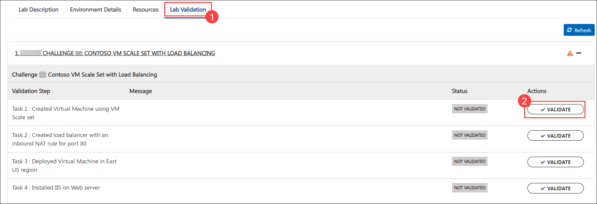
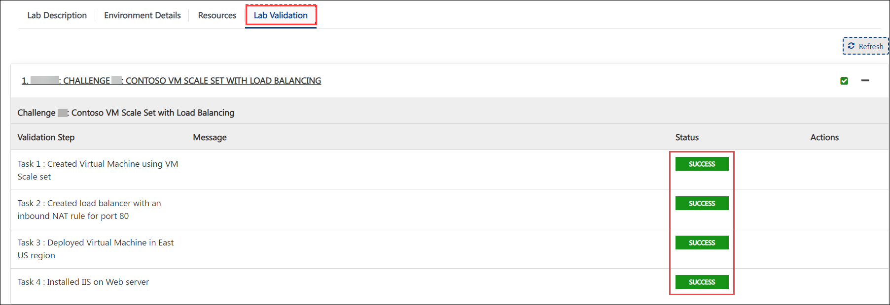
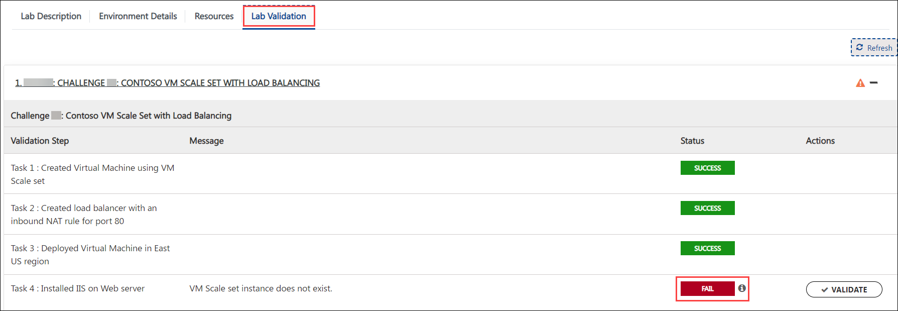

## Challenge 2: Contoso VM Scale Set with Load Balancing

### Estimated duration: 2 Hours

### **Level:** Expert 

### **Challenge Objective:**

Contoso has a web application that needs to be deployed across multiple virtual machines to handle high traffic loads. Your team's challenge is to deploy the web application in a VM scale set in Azure. The web application has the following requirements:

1. The application must run on Windows Server 2019 virtual machine using Scale Set. 

1. The virtual machines must have 2 cores and 4 GB RAM with Standard SSD OS disk configuration.

1. The virtual machines must be deployed to the East US region.

1. The virtual machines must be part of a virtual network with an address space of 10.0.0.0/16 and a subnet with an address space of 10.0.0.0/24.

1. A load balancer with an inbound NAT rule for port 80.

1. A VM scale set with the required configuration.

1. Must be able to survive datacenter level failure. 

  > Your challenge is to deploy the web application in a VM scale set by using an ARM template or Azure Portal.

### Success Criteria:

1. The web application must be accessible from the internet via port 80 and must distribute the load. 

1. The VM scale set must have the specified configuration.

1. Load Balancing must be functional.

1. The virtual machines must not be directly accessible from the internet via port 80 or any other port. 

### Lab Validation

1. After completing the challenge, you need to visit the **Lab Validation (1)** tab and click on the **VALIDATE (2)** button under Actions to perform the validation steps. Verify that you have met the success criteria of the challenge. 

    

1. If the validation status displays **Success** for all the validation steps, **congratulations!**. This means that you have successfully completed the challenge. 

     
     
1. If the validation status displays **Fail**, **don't worry!** This could mean that you did not perform the challenge correctly.

     

1. Hover your mouse over the `i` **(1)** icon to see the error message and determine the root cause of the failure. Based on the error message, revisit the challenge as necessary, and redo the validation by clicking on the **VALIDATE (3)** button again.
      
      

1. If you are still having trouble, you can reach out to the support team via `labs-support@spektrasystems.com` for further assistance. The support team is available to help you to troubleshoot and resolve any technical issues or validation issues that may arise while the lab environment is live.
